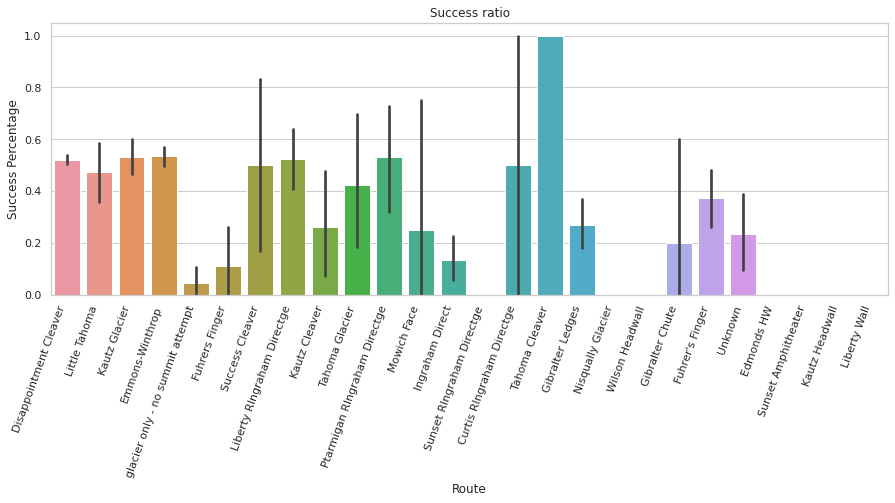
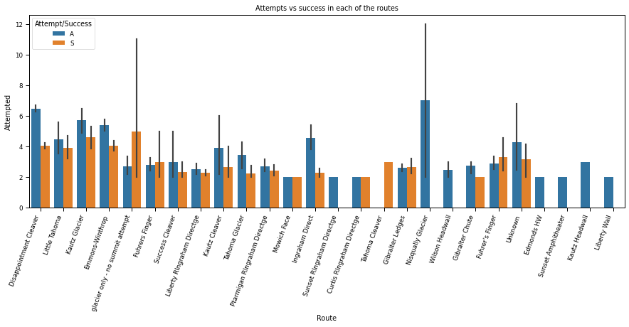
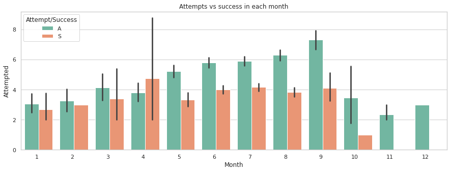

# Pipelines Project

## Choosing the DataFrame

For this project I have chosen the "Mount Rainier Weather and climbing data" dataframe. I found it in kaggle website and I imported the two tables containing data to my jupyter notebook. My goal was to first clean the dataframes, them add some information with the Weather API (Open Weather API) about the weather in that mountain and finally from all this data get information on how successful would be to climb this mountain in November 2020 (the date were this project was developed).

## Data Cleaning

First of all, I imported the dataframes and I performed some basic description methods to see the number of rows and columns, the name of the columns and the data types as well as he null values for each of the dataframes. Then, I merged the two dataframes on the Date to have all the information in one dataframe. Moreover, I realized that some of the values on the "Success Percentage" column were above 1 which can not be possible, so I corrected these values to 1. 

Then, I created two new columns with the information from the month and the year extracted from the date as they will be useful for the data visualization. The values on the table had american measurements, for that reason I tansformed the "Temperature AVG" column from degrees Farhenheit to degrees Celsius. I also changed the Wind Speed column from miles per hour to kilometers per hour.

Finally, I exported the cleaned dataframe.
## Enrichment with API information

For this project I chose a weather API, the Open Weather API, to use it I first requested a token in my account and saved it to the .env file, which was put into the .gitignore file. Then, I made a request to the API in the Onecall option to get the weather for the current day (08/11/2020) at the current hour (17:00) as well as the minute forecast for 1 hour, the hourly forecast, the daily forecast for 7 days and the historical weather for the previous 5 days.

From this request I obtained the temperatures, humidity and wind speed from the 8 of November 2020 to the 15 of November 2020. Then, I created a new dataframe with these values, and I added a new column with the Date and I joined this table with the cleaned dataframe. I also extracted the year and month in their respective columns.

Finally, I exported the enriched dataframe.

## Data visualization

For visualizing the data I first execute the describe function to get the data from the numerical columns, and then I plotted various graphs.

First, I plotted a graph showing the success ratio based on the routes, I showed the success percentage for each route. 

I also made a plot for the most popular routes, being "Disappointment Cleaver" the most climbed route. Then, I showed the attempts versus the success in each of the routes and in each month, being the most successful one the route "Kaultz Glacier" and the month April, although it is not the month with more attempts. 

Next, I wanted to show how the temperature, humidity and wind seed affected the success of the climbers, in order to compare this data to the data obtained in November 2020 to show if it is a good season to climb this mountain. The first plot, which compared the temperature with the success showed that when the temperature is on its highest value (around 2.5 degrees Celsius), the success rate is higher, on the other hand, the plot that showed the relation between the humidity and the success indicated that the success rate is higher when the humidity is lower. Finally, in the plot that relates the wind speed and the success, there was a higher rate of success when the wind speed was lower.

Finally, I plotted the temperatures fom 2014 to 2020 to compare the temperatures in 2020 with the ones from previous years to see if the temperatures in 2020 are higher or lower than the previous ones. I did the same for the humidity conditions and for the wind speed.

In conclusion, I found that in general in November 2020 there are not good conditions for success in climbing Mount Rainier as, although there is a low wind speed, the temperatures are extremely low and there is a high humidity. moreover, looking at the graph that shows attempts and successes by month it can be observed that in November there are very little successes.

## Problems encountered

While developing this project I encontered several problems, one of them was that the APIs I found did not give information about the previous years so I had to check only for the information of the year 2020. Another problem was that there is a column called "Unnamed:0" that appeared after the exportation of data and, alhough I deleted it, it continues appearing in the cleaned dataframe.